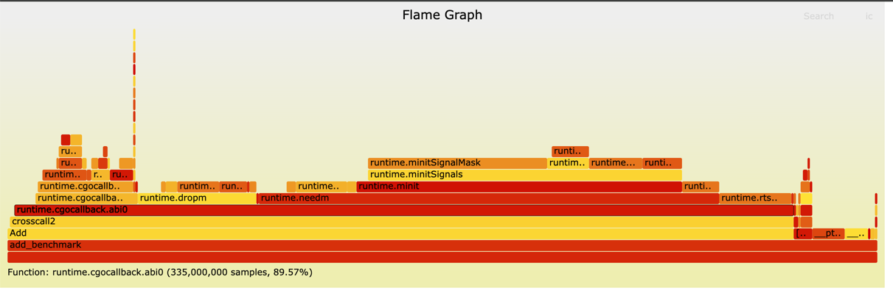

# Go 插件

# Go 插件性能

## Go调用Go插件
测试是 Go程序使用Go插件，执行`func Add(x,y int) int` 函数，测试代码在 [benchmark_test.go](golang/benchmark/benchmark_test.go)

```shell
~ make golang_benchmark
cd plugin && bash -e build.sh
cd golang && CGO_ENABLED=1 go test -v -run=none -bench=Benchmark -count=2 -benchmem ./benchmark/...
goos: linux
goarch: amd64
pkg: github.com/anthony-dong/cgo_demo/golang/benchmark
cpu: Intel(R) Xeon(R) Platinum 8260 CPU @ 2.40GHz
BenchmarkGoPlugin
BenchmarkGoPlugin-8   	569536491	         2.010 ns/op	       0 B/op	       0 allocs/op
BenchmarkGoPlugin-8   	579598886	         2.037 ns/op	       0 B/op	       0 allocs/op
BenchmarkGoNative
BenchmarkGoNative-8   	1000000000	         0.3624 ns/op	       0 B/op	       0 allocs/op
BenchmarkGoNative-8   	1000000000	         0.3492 ns/op	       0 B/op	       0 allocs/op
PASS
ok  	github.com/anthony-dong/cgo_demo/golang/benchmark	3.550s
```
结论就是非常给力 ！！！说实话这种函数调用的开销已经非常低了，Linux上也就是1ns左右(linux x86 && go1.18+)! 性能非常高! 损耗的原因还是动态库的损耗，都能接受！

## C调用Go插件(Cgo)

c调用Go插件，是通过将Go插件编译成 [c动态库](./plugin4) 或者 [c静态库](./plugin5)，比较推荐静态库！可以参考 [plugin4](plugin4) 、[plugin5](./plugin5) , 测试代码在 [add_benchmark.cpp](cpp/add_benchmark.cpp)

1. 测试代码

```cpp
#include <benchmark/benchmark.h>

#include <stdexcept>

#include "plugin.h"

static void BM_CGO(benchmark::State& state) {
  // Perform setup here
  for (auto _ : state) {
    // This code gets timed
    auto x = int(Add(GoInt(1), GoInt(2)));
    if (x != 3) {
      throw std::runtime_error("异常");
    }
  }
}

static void BM_Native(benchmark::State& state) {
  // Perform setup here
  for (auto _ : state) {
    // This code gets timed
    auto x = 1 + 2;
    if (x != 3) {
      throw std::runtime_error("异常");
    }
  }
}

BENCHMARK(BM_CGO);
BENCHMARK(BM_Native);
// Run the benchmark
BENCHMARK_MAIN();
```

2. 测试结果:

```shell
Running output/add_benchmark
Run on (8 X 2394.37 MHz CPU s)
CPU Caches:
  L1 Data 32 KiB (x4)
  L1 Instruction 32 KiB (x4)
  L2 Unified 1024 KiB (x4)
  L3 Unified 36608 KiB (x2)
Load Average: 0.12, 0.17, 0.17
-----------------------------------------------------
Benchmark           Time             CPU   Iterations
-----------------------------------------------------
BM_CGO           1480 ns         1480 ns       481544
BM_Native       0.000 ns        0.000 ns   1000000000000
```

3. 性能损耗 ([火焰图](static/cpp_add_benchmark.svg))



4. 总结

cpp/c 调用 go插件(c lib) 会存在性能劣化的问题，大概单次调用损耗在 1480 ns (linux x86 && go1.18+) 左右! 所以不太推荐c调用go动态库！在字节内部很多业务线迁移至rust后，会存在存量Go插件的迁移，导致rust 调用 go插件性能劣化严重（这个代码比较简单，只涉及到单次调用的开开销，如果逻辑复杂点可能开销更大），本质上原因就是 Go/C 这个桥梁差异较大，我们通过火焰图可以看到大部分开销都在于 cgocallback 上！ 

## Go调用C (Cgo)

这里也是性能劣化严重，推荐直接看我的文章：[Cgo介绍和使用](https://anthony-dong.github.io/2023/05/04/563272b471b5af82d27c85596b1e6342)

# Go插件的问题细说

## [plugin 示例](./plugin1)

1. go.mod
```go
require github.com/tidwall/gjson v1.14.0 // 主程序版本是v1.14.0
```

2. 插件代码实现相关函数实现
```go
import "github.com/tidwall/gjson"

func GetJsonRow(input string, path string) string {
	return gjson.Get(input, path).Raw
}
```
3. 编译此plugin
```shell
bash build.sh
```

## [主程序 示例](./golang)

1. go.mod
```go
require	github.com/tidwall/gjson v1.11.0 // 主程序版本是v1.11.0
```

2. 代码

```go
package main

import (
	"fmt"
	"github.com/tidwall/gjson"
	"plugin"
)

func loadGetJsonRowFunc(lib string) func(input string, path string) string {
	p, err := plugin.Open(lib)
	if err != nil {
		panic(err)
	}
	foo, err := p.Lookup("GetJsonRow")
	if err != nil {
		panic(err)
	}
	return foo.(func(string, string) string)
}

func main() {
	lib := "plugin1/output/plugin.so"
	result := loadGetJsonRowFunc(lib)(`{"k1": true}`, "k1")
	fmt.Println("result =", result)
}
```

3. 运行报错

```shell
panic: plugin.Open("plugin1/output/plugin"): plugin was built with a different version of package github.com/tidwall/gjson
```

## 问题

```shell
panic: plugin.Open("plugin1/output/plugin"): plugin was built with a different version of package github.com/tidwall/gjson
```

如果插件中依赖的包的版本和主程序中依赖的版本不一致，会导致编译不通过！

## 如何解决

1. github.com/tidwall/gjson 包存在不同的版本，那么办法简单就是把依赖的包名给全改了就行了！ 那么就能避免Go检测的问题
```txt
github.com/tidwall/gjson -> t_xxxx/github.com/tidwall/gjson
```

2. 废话不多说，就是下面那坨脚本了: [build.sh](plugin2/build.sh), 项目地址: [plugin2](./plugin2)

```shell
~ objdump -x   plugin2/output/plugin.so | grep 'github.com/tidwall/gjson'
00000000001ad0c0 l     F .text	000000000000007e              local.t_1702492315/github.com/tidwall/gjson.Type.String
00000000001ad140 l     F .text	00000000000001dd              local.t_1702492315/github.com/tidwall/gjson.Result.String
00000000001ad320 l     F .text	00000000000001fd              local.t_1702492315/github.com/tidwall/gjson.Result.Bool
00000000001ad520 l     F .text	0000000000000196              local.t_1702492315/github.com/tidwall/gjson.Result.Int
00000000001ad6c0 l     F .text	0000000000000168              local.t_1702492315/github.com/tidwall/gjson.Result.Uint
00000000001ad840 l     F .text	0000000000000125              local.t_1702492315/github.com/tidwall/gjson.Result.Float
00000000001ad980 l     F .text	000000000000011d              local.t_1702492315/github.com/tidwall/gjson.Result.Time
00000000001adaa0 l     F .text	00000000000002df              local.t_1702492315/github.com/tidwall/gjson.Result.Array
00000000001add80 l     F .text	0000000000000055              local.t_1702492315/github.com/tidwall/gjson.Result.IsObject
```

可以发现包名被替换成了 `t_1702492315/github.com/tidwall/gjson` 

3. 那么引入一个问题，例如都依赖于 gjson.Result 
```go
import "github.com/tidwall/gjson"

func GetJsonPath(input string, path string) gjson.Result {
	return gjson.Get(input, path)
}
```
4. 此时就会出现一个问题
```shell
panic: interface conversion: plugin.Symbol is func(string, string) gjson.Result, not func(string, string) gjson.Result (types from different scopes) 
```
gjson.Result 在插件中已经被我们替换了包名，实际上是 `t_xxxx/github.com/tidwall/gjson.Result`，导致不一致，所以不能直接用结构体进行传输！！！
因此在做数据交互的时候尽可能的使用 builtin type. 如果不满足自行做序列话！
但是大部分插件都可以使用 `接口` 的方式避免此问题！

# 最佳实践

1. 插件代码
```go

// 全部都以接口的形式处理！！
// 这个接口也可以放到一个包里！！

type Request interface {
	GetHeader(key string) string
	GetBody() ([]byte, error)
}

type Response interface {
	SetHeader(key, value string)
	SetBody([]byte) error
}

type plugin struct {
}

// 插件初始化
func (*plugin) Init() error {
	return nil
}

// 插件卸载
func (*plugin) Close() error {
	return nil
}

// 插件逻辑
func (*plugin) Handle(ctx context.Context, req interface{}, resp interface{}) error {
	request := req.(Request) // 接口
	response := resp.(Response) // 接口
	body, err := request.GetBody()
	if err != nil {
		return err
	}
	fmt.Printf("recevie http request body: %s\n", body)
	if err := response.SetBody(body); err != nil {
		return err
	}
	return nil
}

// NewPlugin 创建插件，每个插件都需要定义此函数，且函数签名一致
func NewPlugin() interface{} {
	return &plugin{}
}
```

2. 加载插件

```go
package http_plugin

import (
	"plugin"
)

func Load(lib string) Plugin {
	p, err := plugin.Open(lib)
	if err != nil {
		panic(err)
	}
	foo, err := p.Lookup("NewPlugin")
	if err != nil {
		panic(err)
	}
	return foo.(func() interface{})().(Plugin)
}
```


3. 使用
```go
func main() {
	lib := http_plugin.Load("plugin3/output/plugin.so") // 动态加载
	if err := lib.Init(); err != nil {
		panic(err)
	}
	defer lib.Close()
	if err := http.ListenAndServe(":8080", http.HandlerFunc(func(writer http.ResponseWriter, request *http.Request) {
		ctx := context.Background()
		if err := lib.Handle(ctx, http_plugin.NewHTTPRequest(request), http_plugin.NewHTTPResponse(writer)); err != nil {
			fmt.Printf("[ERROR] %s\n", err.Error())
		}
	})); err != nil {
		panic(err)
	}
}
```

# 总结

1. Go插件提供了很高的性能，但是会存在一个问题，隔离性的问题，导致插件隔离不恰当会出现程序挂掉的问题，比如插件内部代码panic了，且未抓取程序直接挂了，
2. 其次Go插件不支持卸载，所以插件内部尽可能的避免使用一些全局变量！
3. 每个插件之间的包尽可能的采用 [plugin2](./plugin2/build.sh) 脚本处理的方式将包名全部替换，避免依赖包之间的版本冲突！！
4. 插件之间不应该直接依赖实体类型，例如`struct`等，推荐通过Go接口方式依赖，参考 [plugin3](./plugin3) 实现方式是比较好的做法，具体实现代码在 [http_plugin](./golang/http_plugin) 
5. Go插件性能非常的高，Go调用Go插件，性能非常高，基本没有开销，非常适合于一些Go在线服务需要动态加载插件做一些较为复杂的业务逻辑，通常在网关等场景使用！
6. Go插件如果导出 `C动态库/静态库` 被cpp/rust等语言调用的化性能非常的差，劣化较为严重，甚用！